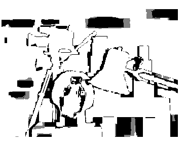
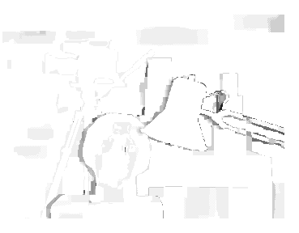

# Disparity Evaluation
It compares the disparity map generated by our algorithm against the ground truth disparity map provided in the dataset.

## Output Image 1 (Absolute Disparity Error)
The bad pixel map that created at the output.

   

## Output Image 2 (Hot and Cold Pixels)
The bad pixel map that created at the output.

   

